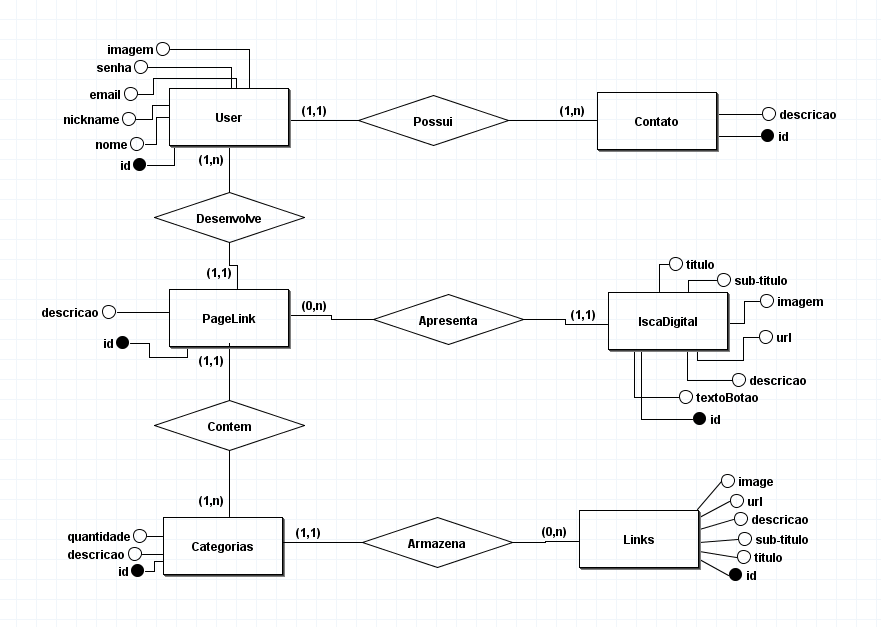

>## Criando um catálogo de jogos usando boas práticas de arquitetura com .NET

## Missão 
Construir uma arquitetura base para uma aplicação .net do zero.

## Detalhe

O primeiro commit é o projeto desenvolvido em aula, a orientação passada desde o
inicio do modulo é para criar uma versão alternativa a gosto e ir além.

## Atualização

A um tempo atrás comecei a criar uma pagina de links como o linktree,
irei modificar este projeto para se tornar a api desse site que comecei a desenvolver.

Ele não esta funcionando corretamente pois as correções foram feitas porém
não conseguir fazer o deploy, devido a um problema que ocorreu com meu HD

Link para acessar o site que está em desenvolvimento CLickLink : [http://clicklink.epizy.com/](http://clicklink.epizy.com/)

## Modelo conceitual, usando como Padrão Visual o Diagrama de entidade relacionamento:

<h1 align="center">
  
</h1>

:computer: Curso realizado na Plataforma DIO : [https://digitalinnovation.one/](https://digitalinnovation.one/)
